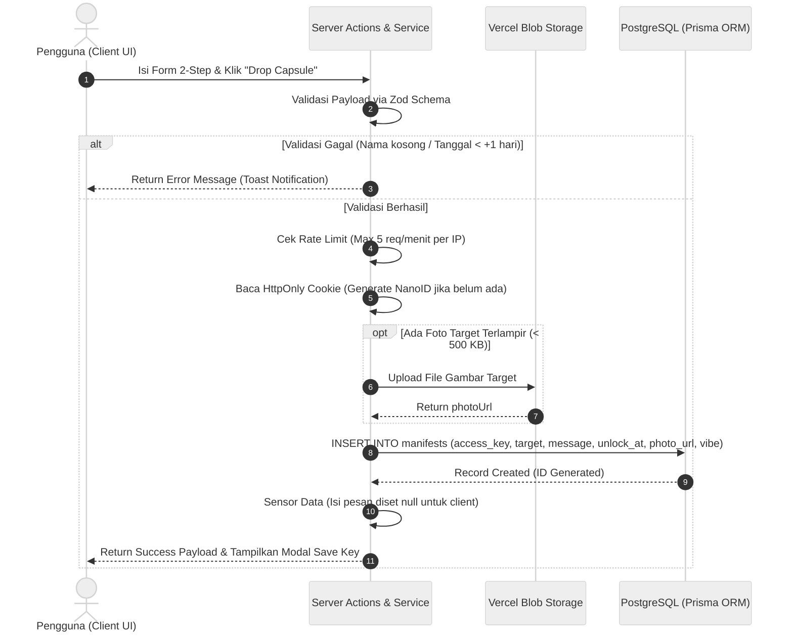
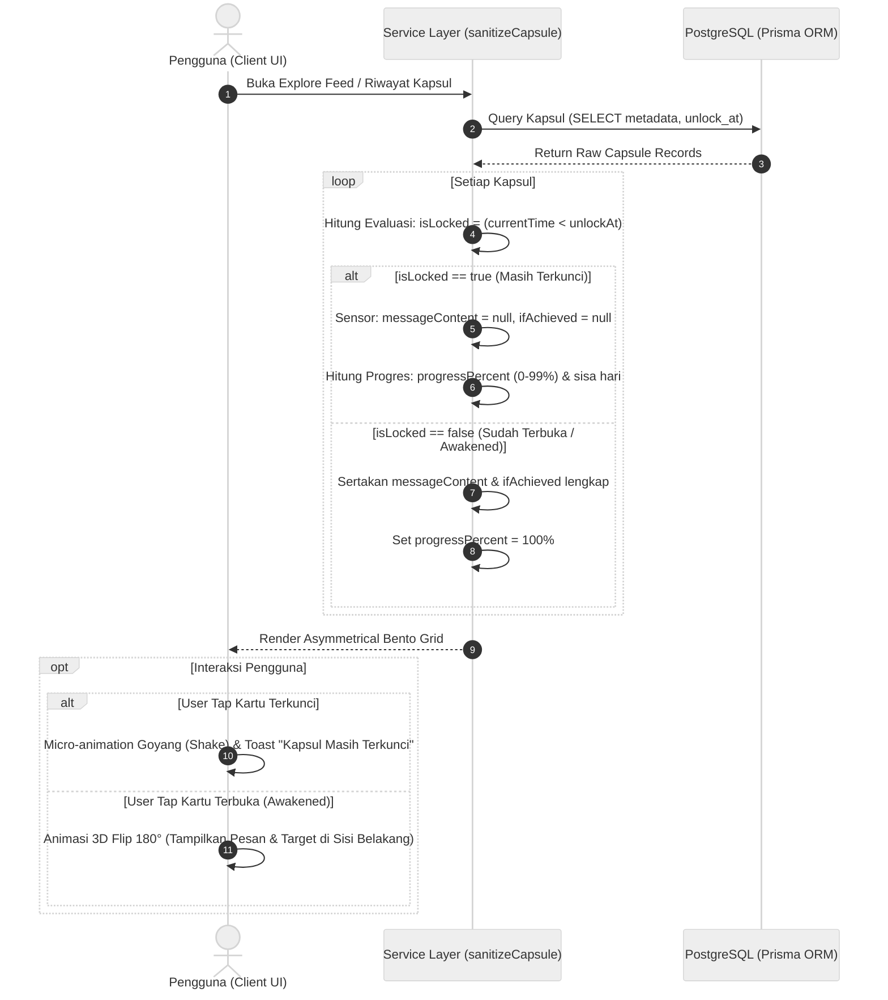
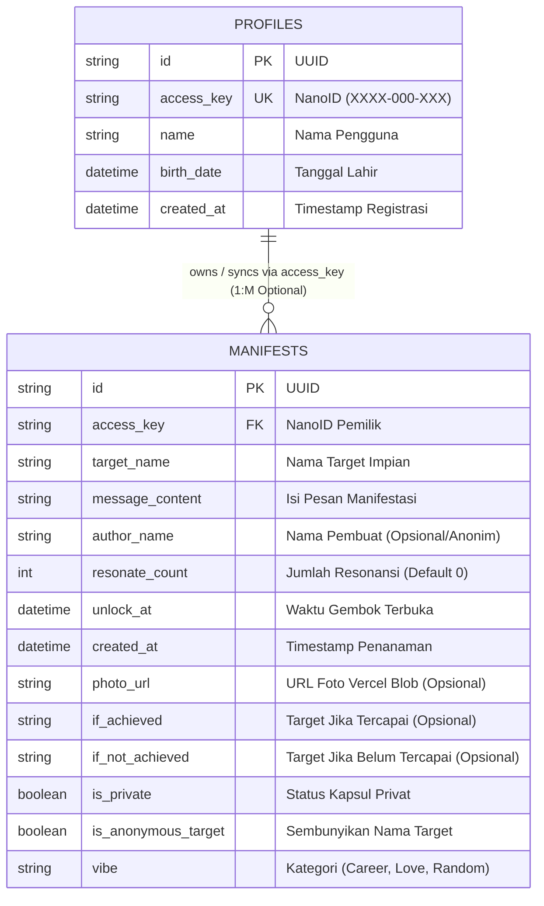

# Technical Specification Document (TSD)
## The Manifesting Capsule — Arsitektur Sistem, Pemodelan UML, Skema Database & Spesifikasi Server Actions

---

## 1. Document Control & Architectural Overview

| Atribut | Keterangan |
| :--- | :--- |
| **Nama Proyek** | The Manifesting Capsule |
| **Tipe Dokumen** | Technical Specification Document (TSD) |
| **Penulis / Pengembang** | Muhammad Ilham Setiawan |
| **Versi Dokumen** | v1.0 |
| **Pola Arsitektur** | Modular Layered Architecture (Colocation Feature-Based Pattern) |
| **Backend & Database**| Next.js Server Actions, Prisma ORM 7+, PostgreSQL (Neon Serverless) |
| **Penyimpanan Media**| Vercel Blob Storage (Kompresi Klien < 500 KB) |
| **Status Dokumen** | Selesai & Terimplementasi |

---

## 2. Technology Stack

* **Frontend & Antarmuka UI:** Next.js 16 (App Router), React 19, TypeScript, Tailwind CSS v4, Framer Motion, Lucide Icons, Shadcn UI / Radix UI, Sonner Toaster.
* **Backend & Server Logic:** Next.js Server Actions, Prisma ORM, Node.js Runtime.
* **Basis Data & Cloud Storage:** PostgreSQL (Neon Cloud / Local Instance), Vercel Blob Storage.
* **Validasi & Utilitas:** Zod Schema Validation, NanoID (Format `XXXX-000-XXX`), html2canvas (Ekspor Kartu 2x Resolusi), qrcode.react, HttpOnly Cookie.

---

## 3. Pola Arsitektur Sistem (Modular Layered Architecture)

Sistem menerapkan **Modular Layered Architecture** dengan prinsip *Colocation*. Seluruh komponen, logika bisnis, query database, dan skema validasi yang berkaitan dengan domain kapsul dikelompokkan ke dalam direktori fitur mandiri (`src/features/capsules/`).

```text
┌────────────────────────────────────────────────────────────────────────┐
│                        HIGH-LEVEL DATA FLOW                            │
└────────────────────────────────────────────────────────────────────────┘

 [ Presentation Layer: UI Component ]   (BentoCard, CapsuleList, DropModal)
                │
                ▼  (Validasi Payload via Zod Schema)
 [ Interface Layer: Server Actions ]    (createCapsuleAction, resonateAction)
                │
                ▼  (Rate Limiting & Server Censorship)
 [ Business Logic Layer: Service ]      (generateAccessKey, sanitizeCapsule)
                │
                ▼  (Query ORM)
 [ Data Access Layer: Repository ]      (createCapsule, getPublicCapsules)
                │
                ▼
 [ Database Layer: PostgreSQL ]         (Tabel manifests & profiles)
```

### Struktur Direktori Proyek
```text
the-manifesting-capsule/
├── prisma/
│   └── schema.prisma              # Skema tabel PostgreSQL & Model Prisma
├── src/
│   ├── app/
│   │   ├── (main)/
│   │   │   ├── page.tsx           # Halaman utama SPA (Explore Feed & Bento Grid)
│   │   │   └── settings/          # Panel sinkronisasi Access Key & profil
│   │   ├── capsule/[id]/          # Halaman tautan berbagi tunggal (Dedicated URL)
│   │   ├── layout.tsx             # Root layout, PWA meta, & Toaster
│   │   └── globals.css            # Desain tema Tailwind CSS v4
│   ├── features/
│   │   └── capsules/              # Modul domain Kapsul (Colocation)
│   │       ├── actions.ts         # Server Actions (Controller Layer)
│   │       ├── services.ts        # Business Logic & Sensor Waktu Gembok
│   │       ├── repository.ts      # Data Access Layer (Prisma queries)
│   │       ├── schemas.ts         # Zod validation schema
│   │       └── components/        # Komponen UI BentoCard & BentoList
│   ├── components/                # Komponen global (Header, BottomNav, SyncPanel)
│   ├── lib/                       # Singleton Prisma, Rate Limiter, Vercel Blob
│   └── types/                     # Definisi TypeScript global
└── docs/                          # Dokumentasi PRD & TSD
```

---

## 4. Pemodelan Visual UML (Activity Diagrams)

### 4.1 Swimlane Activity Diagram: Alur Penanaman Kapsul (*Drop Capsule*)
Diagram berikut memodelkan alur saat pengguna menanam kapsul baru, proses validasi input Zod, pembuatan kunci anonim di cookie, hingga penyimpanan ke Vercel Blob dan basis data:



---

### 4.2 Swimlane Activity Diagram: Alur Inspeksi & Pembukaan Kapsul (*Time-Lock & 3D Flip*)
Diagram berikut memodelkan mekanisme gembok waktu di mana server menyensor konten sebelum tanggal tercapai (*Locked State*), dan mengizinkan pemutaran kartu 3D setelah tanggal gembok terlampaui (*Awakened State*):



---

## 5. Pemodelan Basis Data Relasional & Skema Database

Sistem menggunakan basis data **PostgreSQL** yang dikelola melalui **Prisma ORM**.

### 5.1 Diagram Relasi Entitas (Crow's Foot ERD)



### 5.2 Matriks Kardinalitas Antar Entitas

| Relasi Entitas | Kardinalitas | Aturan Bisnis & Integritas Data |
| :--- | :---: | :--- |
| **`profiles` ─── `manifests`** | `1 : M` *(Optional)* | Satu akun anonim (`access_key`) dapat memiliki **banyak kapsul manifestasi**. Relasi bersifat opsional karena pengguna baru dapat membuat kapsul sebelum melengkapi data profil. |

---

### 5.3 Rincian Definisi Kolom Model Prisma

#### 1. Model `Manifest` (Tabel `manifests`)
Tabel utama yang menyimpan seluruh data kapsul waktu digital:

| Kolom Prisma | Kolom DB (`snake_case`) | Tipe Data | Constraint / Default | Keterangan Bisnis |
| :--- | :--- | :--- | :--- | :--- |
| `id` | `id` | `String` (UUID) | `@id @default(uuid())` | Kunci utama unik setiap kapsul |
| `accessKey` | `access_key` | `String` | `VARCHAR(30)`, Indexed | Kunci kepemilikan anonim pengguna |
| `targetName` | `target_name` | `String` | `VARCHAR(50)`, NOT NULL | Nama impian / tujuan manifestasi |
| `messageContent`| `message_content`| `String` | `TEXT`, NOT NULL | Pesan rahasia yang digembok |
| `authorName` | `author_name` | `String?` | `VARCHAR(30)`, Nullable | Nama pembuat (default: "Anonim") |
| `resonateCount` | `resonate_count` | `Int` | `DEFAULT 0` | Jumlah tanda resonansi dari sesama user |
| `unlockAt` | `unlock_at` | `DateTime` | `TIMESTAMP`, NOT NULL | Waktu sah gembok kapsul terbuka |
| `createdAt` | `created_at` | `DateTime` | `DEFAULT now()` | Waktu penanaman kapsul |
| `photoUrl` | `photo_url` | `String?` | `TEXT`, Nullable | Tautan foto target di Vercel Blob |
| `ifAchieved` | `if_achieved` | `String?` | `VARCHAR(500)`, Nullable | Target komitmen jika impian tercapai |
| `ifNotAchieved` | `if_not_achieved`| `String?` | `VARCHAR(500)`, Nullable | Rencana komitmen jika impian belum tercapai |
| `isPrivate` | `is_private` | `Boolean` | `DEFAULT false` | True = Kapsul tidak muncul di Explore Feed |
| `isAnonymousTarget` | `is_anonymous_target` | `Boolean` | `DEFAULT true` | Menyamarkan target di publik |
| `vibe` | `vibe` | `String` | `DEFAULT 'Random'` | Kategori: `Career & Study`, `Love & Self`, `Random` |

#### 2. Model `Profile` (Tabel `profiles`)
Tabel profil personal opsional untuk personalisasi pengguna:

| Kolom Prisma | Kolom DB (`snake_case`) | Tipe Data | Constraint / Default | Keterangan Bisnis |
| :--- | :--- | :--- | :--- | :--- |
| `id` | `id` | `String` (UUID) | `@id @default(uuid())` | Kunci utama unik profil |
| `accessKey` | `access_key` | `String` | `UNIQUE`, Indexed | Kunci akses unik sinkronisasi akun |
| `name` | `name` | `String` | `VARCHAR(100)`, NOT NULL | Nama panggilan pengguna |
| `birthDate` | `birth_date` | `DateTime` | `TIMESTAMP`, NOT NULL | Tanggal lahir pengguna |
| `createdAt` | `created_at` | `DateTime` | `DEFAULT now()` | Waktu inisialisasi profil |

---

## 6. Algoritma Logika Bisnis & Sensor Waktu Gembok

### 6.1 Formula Perhitungan Progres Waktu (*Time Progress Calculation*)
Sistem menghitung persentase perjalanan waktu gembok secara dinamis:

$$\text{Total Duration} = \text{unlockAt} - \text{createdAt}$$
$$\text{Elapsed Time} = \text{currentTime} - \text{createdAt}$$
$$\text{Progress \%} = \min\left(\max\left(\left\lfloor \frac{\text{Elapsed Time}}{\text{Total Duration}} \times 100 \right\rfloor, 0\right), 99\right)$$

*Jika $\text{currentTime} \ge \text{unlockAt}$, maka $\text{Progress \%} = 100\%$ dan status kapsul berubah menjadi **Awakened**.*

---

### 6.2 Mekanisme Sensor Data Server (*Zero-Leakage Censorship*)
Untuk mencegah celah keamanan inspeksi frontend (*DevTools Network Tab*), penyensoran dilakukan pada layer service sebelum data dikirim ke klien:

```typescript
// Cuplikan Logika Penyensoran di src/features/capsules/services.ts
export function sanitizeCapsuleForClient(capsule: RawCapsule): ClientCapsule {
  const isLocked = new Date() < new Date(capsule.unlockAt);
  
  return {
    ...capsule,
    // Jika masih terkunci, data pesan di-set NULL total
    messageContent: isLocked ? null : capsule.messageContent,
    ifAchieved: isLocked ? null : capsule.ifAchieved,
    ifNotAchieved: isLocked ? null : capsule.ifNotAchieved,
    isLocked,
    progressPercent: isLocked ? calculateProgress(capsule) : 100,
  };
}
```

---

## 7. Spesifikasi Kontrak Server Actions / API Handlers

Semua komunikasi data antara antarmuka klien dan server menggunakan **Next.js Server Actions** dengan amplop respon standar:

```typescript
type ServerActionResponse<T> = {
  success: boolean;
  data?: T;
  error?: string;
};
```

---

### 7.1 Spesifikasi Server Actions Utama

#### 1. `createCapsuleAction(formData: FormData)`
* **Fungsi:** Menanam kapsul baru, mengunggah foto ke Vercel Blob (jika ada), dan menginisialisasi cookie kunci anonim.
* **Validasi Zod:** `CreateCapsuleSchema`
* **Respon Sukses:**
```json
{
  "success": true,
  "data": {
    "id": "c1f7a4e2-89ab-4cde-0123-456789abcdef",
    "accessKey": "MANI-839-LUV",
    "targetName": "Lolos Beasiswa LPDP",
    "messageContent": null,
    "photoUrl": "https://blob.vercel-storage.com/...jpg",
    "isLocked": true,
    "progressPercent": 0,
    "daysLeft": 365,
    "vibe": "Career & Study"
  }
}
```

#### 2. `getPublicCapsulesAction(page: number, limit: number)`
* **Fungsi:** Mengambil data kapsul publik berpaginasi untuk Explore Feed (*Asymmetrical Bento Grid*).
* **Respon Sukses:**
```json
{
  "success": true,
  "data": {
    "capsules": [ ... ],
    "total": 42,
    "hasMore": true
  }
}
```

#### 3. `getMyCapsulesAction()`
* **Fungsi:** Mengambil riwayat seluruh kapsul milik user berdasarkan cookie `manifesting_access_key`.
* **Respon Sukses:**
```json
{
  "success": true,
  "data": [ ... ]
}
```

#### 4. `resonateAction(capsuleId: string)`
* **Fungsi:** Menambah 1 angka resonansi (*Atomic Increment*) pada kapsul terpilih.
* **Rate Limit:** Maksimal 10 request per menit per IP.
* **Respon Sukses:**
```json
{
  "success": true,
  "data": {
    "resonateCount": 15
  }
}
```

#### 5. `syncAccessKeyAction(key: string)` & `logoutAction()`
* **Fungsi:** Menyetel atau menghapus `manifesting_access_key` pada HttpOnly Cookie perangkat untuk sinkronisasi akun.

---

### 7.2 Standarisasi Penanganan Error

| Tipe Error | Kode Status / Respon | Contoh Kasus |
| :--- | :--- | :--- |
| **Validation Error** | `{ success: false, error: "..." }` | Tanggal gembok di masa lalu atau nama target kosong |
| **Rate Limit Exceeded** | `{ success: false, error: "Terlalu banyak permintaan..." }` | Melakukan spam pembuatan kapsul $> 5$ kali/menit |
| **Data Not Found** | `{ success: false, error: "Kapsul tidak ditemukan..." }` | ID Kapsul tidak terdaftar di database |
| **Server Failure** | `{ success: false, error: "Gagal memproses data..." }` | Database connection timeout atau Vercel Blob error |

---

## 8. Keamanan, Rate Limiting & Tata Kelola Dokumen

* **HttpOnly Cookie Security:** Kunci akses disimpan pada cookie dengan atribut `HttpOnly`, `SameSite: Lax`, dan `Secure: true` (di production) untuk mencegah eksploitasi serangan XSS.
* **In-Memory IP Rate Limiting:** Melindungi Server Actions dari serangan *Denial of Service (DoS)* dan bot *spamming*.
* **Dokumentasi Terintegrasi di Repositori:** Dokumen PRD dan TSD dikelola langsung di dalam repositori Git menggunakan Markdown untuk menjamin ketertelusuran arsitektur sistem.
